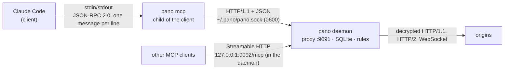
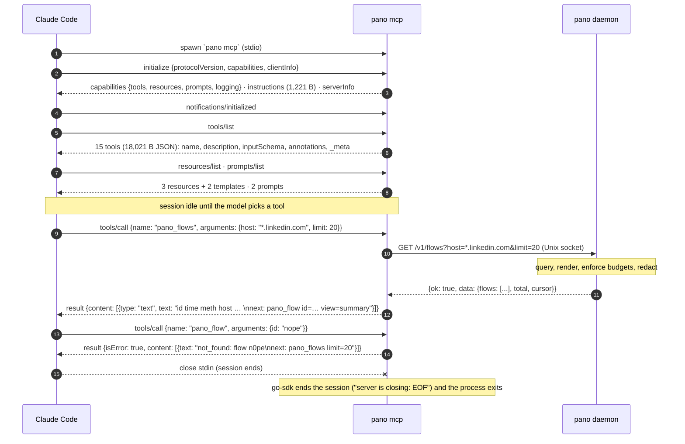
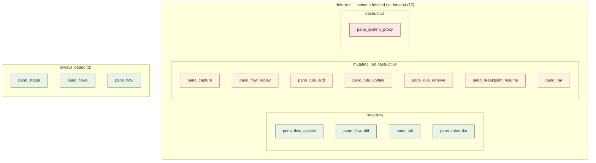
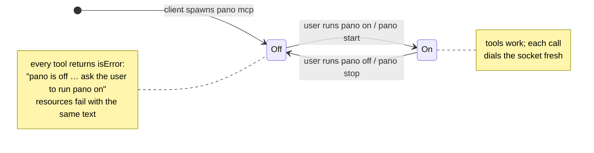

# How an agent talks to pano

[mcp.md](mcp.md) is the catalogue — what the tools do. This page is the
wire: what actually happens between an MCP client such as Claude Code and
`pano mcp`, measured on a real session (Claude Code, pano built from
`1ec8ffe`, `modelcontextprotocol/go-sdk` v1.7.0, macOS, 2026-08-28). Every
number below was captured, not estimated.

## Topology

Three processes, two links. The MCP server holds no state of its own.



- The client spawns `pano mcp` **once per session** and keeps it for the
  session's lifetime; closing its stdin ends the server.
- `pano mcp` is a child of the client. The daemon is not: it is started
  by the user (`pano on` / `pano start`), detached, and outlives every
  client ([ADR 0006](adr/0006-mcp-follows-the-daemon.md)).
- Every tool call is one fresh HTTP request over the socket, so the MCP
  process never needs a reconnect when the daemon restarts.

## Registration

The client knows exactly one thing about pano: a command to spawn.

```json
"pano": { "type": "stdio", "command": "/path/to/pano", "args": ["mcp"], "env": {} }
```

(`~/.claude.json` for user scope, written by `pano mcp install`.) No URL,
port or token is involved for stdio.

## Session lifecycle



### The captured handshake

```
→ {"jsonrpc":"2.0","id":1,"method":"initialize","params":{"protocolVersion":"2025-06-18","capabilities":{},"clientInfo":{"name":"trace","version":"0"}}}
← {"jsonrpc":"2.0","id":1,"result":{
     "capabilities":{"logging":{},"prompts":{"listChanged":true},"resources":{"listChanged":true},"tools":{"listChanged":true}},
     "instructions":"pano is a local HTTPS proxy that records this Mac's traffic … every result ends with a next: hint.",
     "serverInfo":{"name":"pano","title":"pano — all-seeing HTTPS proxy","version":"…"}}}
→ {"jsonrpc":"2.0","method":"notifications/initialized"}
→ {"jsonrpc":"2.0","id":2,"method":"tools/list"}
← … 15 tools …
```

The `instructions` string is pasted verbatim into the model's system
prompt by Claude Code, which is why it is kept under 2 KB (Claude Code
truncates longer ones). The `listChanged` capabilities are go-sdk defaults;
pano never emits those notifications (see *What pano does not use*).

## What a tool advertises

Each entry in `tools/list` carries four things the client acts on. Here is
`pano_flow` exactly as sent (description elided):

```json
{
  "name": "pano_flow",
  "_meta": { "anthropic/alwaysLoad": true, "anthropic/maxResultSizeChars": 200000 },
  "annotations": { "title": "pano flow", "readOnlyHint": true, "idempotentHint": false, "openWorldHint": false },
  "inputSchema": {
    "type": "object",
    "properties": {
      "id":             { "type": "string",  "description": "flow id from pano_flows" },
      "part":           { "type": "string",  "description": "request|response|both (default both)" },
      "view":           { "type": "string",  "description": "summary|schema|truncated|pretty|raw (default summary)" },
      "path":           { "type": "string",  "description": "gjson path into the JSON body, e.g. choices.0.message.content" },
      "max_bytes":      { "type": "integer", "description": "body budget in bytes (default 4096, hard cap 1048576)" },
      "headers":        { "type": ["null", "boolean"], "description": "include headers (default true)" },
      "reveal_secrets": { "type": "boolean", "description": "show secrets unredacted (audited)" }
    },
    "required": ["id"],
    "additionalProperties": false
  }
}
```

| Field | Source in pano | What the client does with it |
|---|---|---|
| `name` | `mcp.Tool{Name: "pano_flow"}` | exposed to the model as `mcp__pano__pano_flow` (`mcp__<server>__<tool>`) |
| `description` | the `Description:` string (< 2 KB) | the model's only documentation |
| `inputSchema` | **reflected from the Go input struct** (`flowIn`) via `json:` and `jsonschema:"…"` tags; `additionalProperties:false` | arguments are validated before the call is sent |
| `annotations` | `readOnly(...)` / `mutating(...)` helpers | permission prompting; read-only tools are cheaper to approve |
| `_meta.anthropic/alwaysLoad` | set on `pano_status`, `pano_flows`, `pano_flow` | those three schemas are in the model's context from the start; the other twelve are **deferred** and fetched on demand (Claude Code's `ToolSearch`) |
| `_meta.anthropic/maxResultSizeChars` | `200000` on `pano_flow` and `pano_har` | raises Claude Code's default ~25k-token cap on a tool result |



Green = `readOnlyHint:true`; amber = mutating, `destructiveHint:false`;
red = `pano_system_proxy`, the only tool with `destructiveHint:true,
openWorldHint:true` — and it refuses without `confirm:"yes"`.

## A tool call, end to end

1. Client validates arguments against `inputSchema`, sends
   `tools/call {name, arguments}` on stdin.
2. go-sdk unmarshals `arguments` into the typed Go struct and calls the
   handler (`internal/mcpserver/tools.go`).
3. The handler makes **one** HTTP request through `internal/client` —
   a normal Go `http.Client` whose dialer opens `~/.pano/pano.sock`
   instead of TCP. No token on the socket; file mode 0600 is the auth.
4. The daemon's control API (`/v1/...`) does all the work: query the ring
   or SQLite, render the view, enforce `max_bytes` and list limits,
   **redact secrets**, write audit lines. Envelope: `{ok:true, data}` or
   `{ok:false, error:{code, message, hint}}`.
5. The handler formats text (`FormatRows`, `FormatStatus`, …), appends a
   `next:` line, and returns **one `text` content block**.

Errors are deliberately *not* JSON-RPC errors: a bad id, a missing rule or
an offline daemon all come back as `isError:true` text with a `next:` hint,
so the model recovers in-band. Resources are the exception — the protocol
has no `isError` for `resources/read`, so those surface as JSON-RPC errors
with the same message text.

### Sizes that matter

| Item | Measured | Why it matters |
|---|---|---|
| `tools/list` response | 18,021 B for 15 tools | paid once per session, but the three `alwaysLoad` schemas sit in every model turn |
| `instructions` | 1,221 B | Claude Code truncates at ~2 KB |
| `pano_flows` row | ~40 tokens | 20 rows ≈ 800 tokens |
| `pano_flow view=summary` | ≤ ~1.5 KB body digest per part, plus headers | headers can dominate — pass `headers=false` when they are known |
| `pano_tail wait_ms` | capped at 25,000 | stays under Claude Code's ~60 s request timer |
| any tool result | ~25k tokens unless `maxResultSizeChars` raises it | `pano_flow`/`pano_har` declare 200,000 chars |

## Off and on

pano only runs between the user's `pano on`/`pano start` and `pano off`/
`pano stop`. The MCP process is up for the whole client session regardless,
so the model sees two states of the same server:



Nothing has to be reconnected on the Off → On edge, and the model cannot
cross it itself — starting a MITM proxy stays a deliberate terminal action,
like installing the CA. `pano_status` says "pano is off" and `pano status`
says "not running"; both point at `pano on`.

## What pano does not use

- **Server-initiated messages** (`notifications/resources/updated`,
  `subscriptions`, logging notifications). Claude Code's handling of them
  is undocumented and has changed between releases, and unrequested
  messages spend context tokens the model did not ask for. Watching traffic
  is a long-poll (`pano_tail`) — [ADR 0003](adr/0003-mcp-polling-not-push.md).
- **Sampling / elicitation.** Nothing flows server → model except tool
  results.
- **stdio for anything but protocol.** Logs go to stderr at WARN; the
  autostart path that used to print to stdout is gone.

## Worked example: a token-efficient search

"I just sent a LinkedIn connection request — find it." Measured on a live
session with the system proxy on:

| Step | Call | Result | Cost |
|---|---|---|---|
| 1 | `pano_flows host=*.linkedin.com method=["POST"] since=5m limit=30` | 30 rows of 58; the interesting ones are three `flagship-web/rsc-action/actions/server-request` POSTs; the rest (`/to11y…`, `/tapi…`, `/sensorCollect`) are telemetry | ~1.2k tokens |
| 2 | `pano_flows q=invit since=5m` | `no flows match` — the response is a binary RSC stream, and the request JSON never says "invitation" | ~30 tokens |
| 3 | `pano_flow id=473 view=summary` | URL carries `sduiid=…mynetwork.addaAddConnection`; body digest shows `requestId`, 4 keys, notable state keys | ~2.5k tokens (LinkedIn's CSP header is most of it) |
| 4 | `pano_flow id=457 view=summary headers=false`, same for `454` | `addaClearUnseenInvitationsMutation`, `mojoTabsBadge` — page-load noise, ruled out | ~250 tokens each |
| 5 | `pano_flow id=473 part=request headers=false view=pretty path=requestedArguments.payload max_bytes=2500` | invitee member id, profile URL, `origin: InvitationOrigin_PYMK_COHORT_SECTION` | ~900 tokens |

Five calls, no raw body, ~5k tokens total. Two reusable lessons: the new
LinkedIn frontend ("SDUI") puts the operation only in the `sduiid` query
parameter and `requestId` of a generic `server-request` POST, so filter on
`path=/flagship-web/rsc-action/*` rather than searching bodies; and when
the first summary reveals that headers are large and known, drop them
(`headers=false`) for every subsequent flow.

## Gotchas for other clients

- **Keep stdin open until the last response.** The go-sdk stdio server
  aborts in-flight work when stdin reaches EOF: piping a batch of requests
  with `printf … | pano mcp` produces *no* output at all. Drive it from a
  process that closes stdin only after reading the replies.
- **Flow ids are normalised before lookup.** The short-id alphabet has no
  `o`/`l`, so `pano_flow id=nope` reports `not_found: flow n0pe`. Copy ids
  from `pano_flows` output rather than retyping them.
- **Streamable HTTP is stateless and unauthenticated** on loopback; it is
  mounted inside the daemon, so it is off whenever pano is off.
